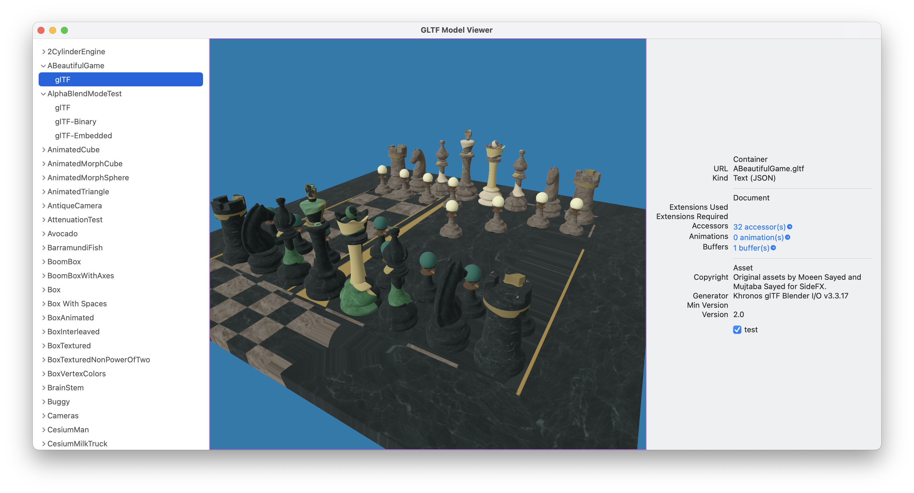

# SwiftGLTF

A Swift library for loading, parsing and viewing GLTF files using RealityKit and/or SceneKit.

## Features

* Loading, parsing and introspecting GLTF and GLB files.
* Converting GLTF models into RealityKit Entities

## Package Contents

* SwiftGLTF - SwiftPackage for loading and conversion of GLTF/GLB files.
* SwiftGLTFViewer -- macOS CLI project for viewing files. This project downloads the latest version of the KronosGroup GLTF sample models and displays them in a RealityKit view.

## Status

Incomplete. Currently only supports a subset of the [GLTF 2.0](https://registry.khronos.org/glTF/specs/2.0/glTF-2.0.html) spec - not all KronosGroup sample models will load or render correctly.

## Caveats

This code is incomplete "hobby" code and should probably not be used in production. See CAVEATS.md for more details.

## License

SwiftGLTF is available under the BSD 3 clause license. See the LICENSE file for more info.
