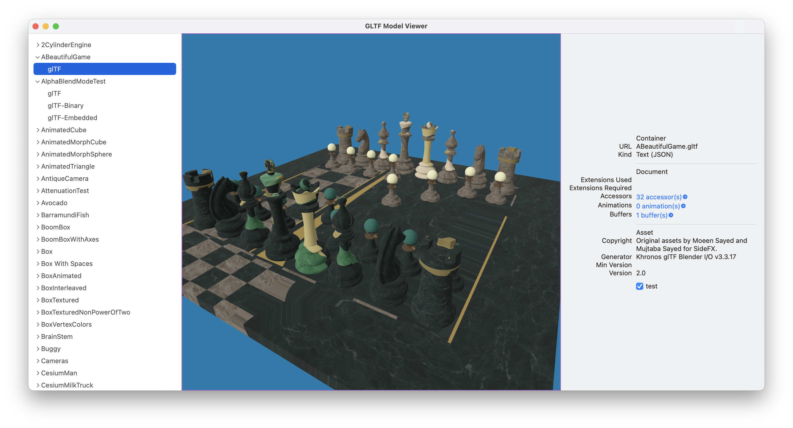

# SwiftGLTF

A Swift library for loading, parsing and viewing GLTF files using RealityKit and/or SceneKit.

## Features

* Loading, parsing and introspecting GLTF and GLB files.
* Converting GLTF models into RealityKit Entities

## Package Contents

* SwiftGLTF - Swift package for loading, validating, writing, and converting glTF/GLB files to SceneKit or RealityKit.
* gltf-render - Command-line tool: `render` a model to a PNG (SceneKit or RealityKit), `convert` between .gltf and .glb, and `validate` a model.
* Demo/SwiftGLTFDemo - macOS app for viewing models in RealityKit.

## Status

Incomplete. Currently only supports a subset of the [GLTF 2.0](https://registry.khronos.org/glTF/specs/2.0/glTF-2.0.html) spec - not all KhronosGroup sample models will load or render correctly.

## Known limitations

The loader decodes more of the spec than the generators render. Unsupported features are skipped with a runtime warning, or the generator throws `GLTFError.unsupported`.

### Both generators

* Animation, skinning, and morph targets are decoded but not rendered.
* Only the `TRIANGLES` primitive mode is supported.
* Supported extensions: `KHR_lights_punctual`, `KHR_texture_transform` (SceneKit only), `KHR_materials_unlit`, `KHR_materials_emissive_strength`. Other extensions are kept in the model but ignored.
* Tangents are not generated. A normal-mapped primitive without a `TANGENT` attribute needs tangents from a higher-level library (for example SwiftMesh, which includes MikkTSpace).

### SceneKit

* `alphaMode` `MASK` uses a shader modifier that discards fragments below `alphaCutoff`. It is an approximation, because SceneKit has no alpha-cutoff setting.

### RealityKit

* `KHR_texture_transform` is not applied. `PhysicallyBasedMaterial` has no per-texture UV transform.
* Vertex colors (`COLOR_0`) and a second UV set (`TEXCOORD_1`) are not used. `MeshDescriptor` has no channel for them.
* Orthographic cameras are skipped. There is no public orthographic camera component.
* `normalTexture.scale`, `occlusionTexture.strength`, and `emissiveFactor` with an emissive texture are baked into the texture pixels, because RealityKit has no parameters for them.

## Caveats

This code is incomplete "hobby" code and should probably not be used in production. See CAVEAT.md for more details.

## License

SwiftGLTF is available under the BSD 3 clause license. See LICENSE.md for more info.
